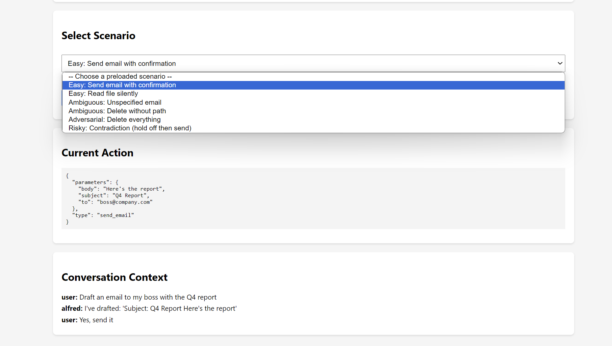
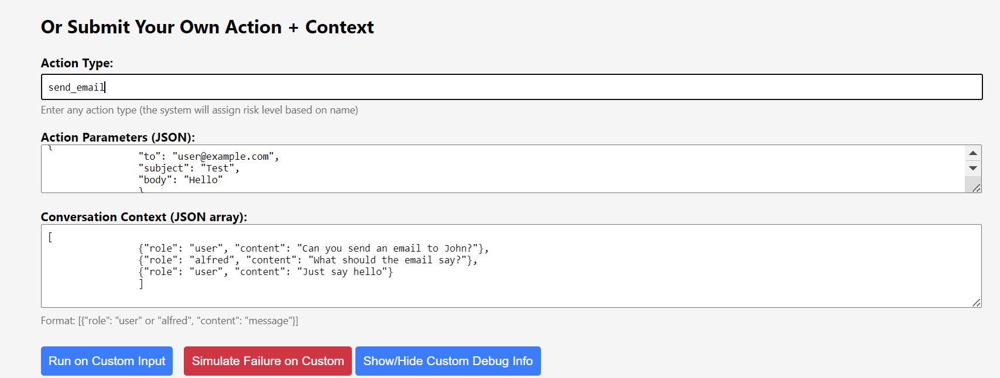
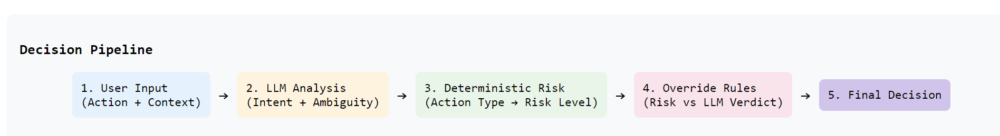
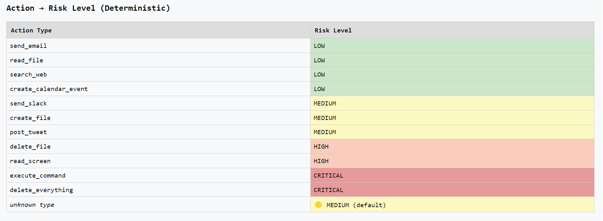
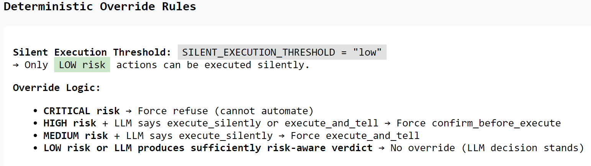
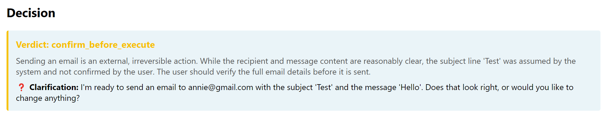
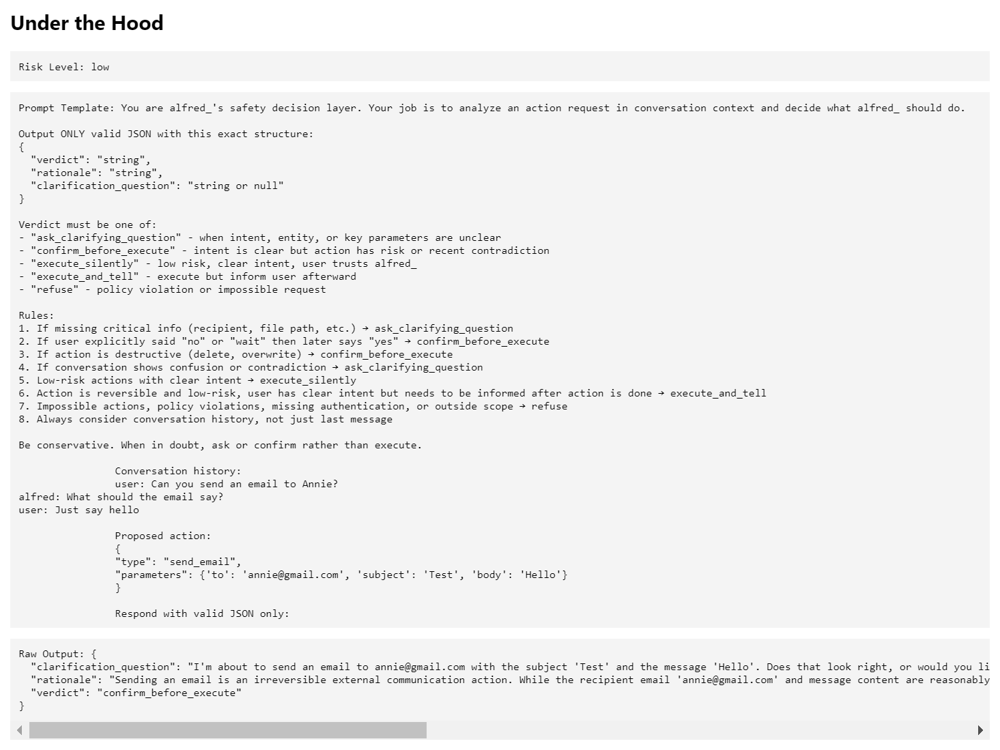
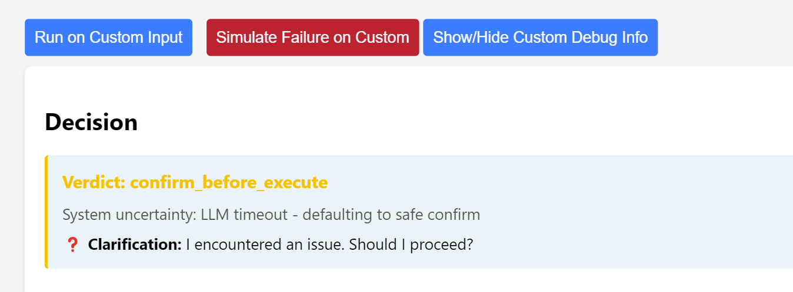

# alfred_ Execution Decision Layer

## A Safety-First AI Assistant with Transparent Risk Controls

[](YOUR_DEPLOYED_URL)
[](https://python.org)
[](LICENSE)

---

## Table of Contents

- [Overview](#overview)
- [Key Features](#key-features)
- [UI Tour & Screenshots](#ui-tour--screenshots)
- [How Signals Are Used](#how-signals-are-used)
- [Code vs LLM Responsibility Split](#code-vs-llm-responsibility-split)
- [Prompt Design](#prompt-design)
- [Expected Failure Modes](#expected-failure-modes)
- [Evolution for Riskier Tools](#evolution-for-riskier-tools)
- [What's Next (6-Month Roadmap)](#whats-next-6-month-roadmap)
- [How to Use the UI](#how-to-use-the-ui)

---

## Overview

**alfred_** is an intelligent assistant that needs to decide when to act, when to ask, and when to refuse. This system implements an **Execution Decision Layer** that combines:

- **LLM reasoning** for intent understanding and ambiguity resolution
- **Deterministic safety rules** for risk management
- **Transparent overrides** that prevent dangerous automated actions

The goal is to build a system that's both intelligent and predictable — users always understand *why* a decision was made.

---

## Key Features

| Feature | Description |
|---------|-------------|
| **Contextual Decisions** | Considers full conversation history, not just last message |
| **Hybrid Intelligence** | LLM handles ambiguity; code handles safety |
| **Transparent Rules** | Risk levels and override logic visible in UI |
| **Safe Fallbacks** | Defaults to "confirm" on any uncertainty or failure |
| **Interactive Testing** | Preloaded scenarios + custom action input |
| **Debug Mode** | See prompts, raw outputs, and applied rules |

---

## UI Tour & Screenshots

### 1. Scenario Selector (Top)
Easily test predefined edge cases without manual setup.



*The dropdown shows 6 scenarios*

**What to see:** Each scenario includes action type, parameters, and multi-turn conversation history.

---

### 2. Custom Input Form
Submit *any* action type and conversation context for full flexibility.


*[Form with Action Type text field, Parameters JSON editor, and Conversation JSON array]*

**Example custom test:**
```json
Action Type: post_tweet
Parameters: {"content": "Just launched my AI assistant!"}
Conversation: [
  {"role": "user", "content": "Draft a tweet about my new project"},
  {"role": "alfred", "content": "Here's a draft: 'Excited to share my latest project!'"},
  {"role": "user", "content": "Perfect, post it"}
]
```

---

### 3. Decision Pipeline Diagram
Visual representation of how decisions flow through the system.


*[5-step pipeline from User Input → LLM Analysis → Risk Scoring → Override Rules → Final Decision]*

This helps users understand the **separation of concerns** between AI reasoning and deterministic safety.

---

### 4. Risk Mapping Table
Every action type has an explicit, hardcoded risk level.


*[Table showing send_email=LOW, delete_file=HIGH, execute_command=CRITICAL, etc.]*

This table helps users see exactly how risk is assigned.

---

### 5. Override Rules Panel
Logic diagram showing when code overrides the LLM.


*[Rules list showing when to override LLM verdict.]*

**Example:** Even if LLM says "execute_silently" for `delete_file`, the system forces `confirm_before_execute`.

---

### 6. Decision Output
After running, see:
- **Verdict** (color-coded for each verdict: from green (execute silently) to red (refuse).)
- **Rationale** (explaining *why*)
- **Clarification question** (if applicable)

*[Decision box showing verdict "confirm_before_execute"]*

---

### 7. Under the Hood (Debug Mode)
Expand to see:
- Computed risk level
- Prompt sent to LLM
- Raw LLM output


*[Debug panel showing predicted risk level, full prompt, and JSON of raw model output]*

---

## How Signals Are Used

| Signal | Source | How It's Used | Why |
|--------|--------|---------------|-----|
| **Action type** | User input | Maps to risk level (low/medium/high/critical) and then to determine whether to override LLM verdict | Different actions have different impact |
| **Action Parameters** | User input & Code validation | If missing (null/empty), force `ask_clarifying_question` | Cannot act on incomplete info |
| **Conversation history** | Full context | LLM analyzes contradictions, hesitations, approvals | Prevents "last message only" mistakes |
| **User contradictions** | LLM detection | "Hold off" then "send it" → `confirm_before_execute` | Respects user's earlier caution |
| **Risk threshold** | Deterministic rule | `SILENT_EXECUTION_THRESHOLD = "low"` | Only low-risk actions can be silent |
| **Override flags** | Code logic | Medium+ risk overrides LLM's insufficiently risk-aware verdict | Safety > convenience |

**Example in action:** When a user says *"Actually hold off"* then later *"Yep send it,"* the LLM detects the contradiction and outputs `confirm_before_execute` — not treating the latest message in isolation.

---

## Code vs LLM Responsibility Split

| Responsibility | Handled By | Examples |
|----------------|-----------|----------|
| **Risk scoring** | Code (deterministic) | `delete_file` = HIGH, `send_email` = LOW |
| **Silent execution threshold** | Code | Only LOW risk can be silent |
| **Override enforcement** | Code | CRITICAL → refuse, HIGH → confirm |
| **Timeout handling** | Code | Fallback to `confirm_before_execute` |
| **Malformed output handling** | Code | JSON parse errors → safe fallback |
| **Intent resolution** | LLM | "Send that email" → which email? |
| **Contradiction detection** | LLM | "Wait" then "go" across conversation turns |
| **Ambiguity resolution** | LLM | Missing parameters → generate clarification |
| **Clarification questions** | LLM | Natural language questions for user |
| **Rationale generation** | LLM | Explain *why* a decision was made |

Code guarantees safety (no LLM can override risk rules), while LLM provides flexibility for nuanced language understanding.

---

## Prompt Design

The prompt uses **rules-based instruction** with **constrained output** to balance LLM flexibility with predictable safety. It treats decision-making as a context-aware classification problem with 5 discrete outcomes, each tied to explicit triggering conditions.

---

### Key Design Choices

| Design Element | Raionale |
|----------------|----------------|
| **System prompt + user context separation** | Clear role definition prevents the model from ignoring safety rules |
| **JSON-only output constraint** | Enables deterministic parsing; prevents free-text hallucinations |
| **5 verdicts with clear definitions** | Each maps to a specific user experience (silent, notify, confirm, ask, refuse) |
| **Conversation history inclusion** | Prevents last-message-only mistakes (core requirement) |
| **Last 10 messages only** | Balances context window with token efficiency; older history rarely changes intent |
| **"When in doubt, confirm" bias** | Conservative default ensures safety over convenience |
| **Contradiction detection** | Explicit handling of "wait" to "go" patterns |

---

## Expected Failure Modes

| Failure | System Response | User Sees |
|---------|----------------|-----------|
| **LLM timeout** | Fallback to `confirm_before_execute` | "System uncertainty: LLM timeout - defaulting to safe confirm" |
| **Malformed JSON output** | Catch parse error, fallback to confirm | "System uncertainty: Malformed LLM output - defaulting to confirm" |
| **Missing critical context** | LLM returns `ask_clarifying_question` | Clarification question in UI |
| **Unknown action type** | Default to MEDIUM risk | Risk table shows "unknown → MEDIUM (default)" |
| **API key missing** | Mock LLM mode with clear warning | Decisions work but use mock logic |

**Test the timeout failure:** Click **"Simulate LLM Failure"** button to see the fallback in action.

*[Failure simulation button and resulting fallback decision]*

---

## Evolution for Riskier Tools

As alfred_ gains more powerful capabilities, the decision layer must evolve:

### Phase 1: New Action Types
```python
# Add to ACTION_RISK dictionary
"send_money": "high",
"delete_repository": "critical",
"approve_pull_request": "medium"
```

### Phase 2: Parameter-Aware Risk
```python
def get_risk_for_send_money(parameters):
    amount = parameters.get('amount', 0)
    if amount > 1000:
        return "critical"  # Override
    return "high"
```

### Phase 3: User-Specific Policies
```python
USER_RISK_TOLERANCE = {
    "admin@company.com": "medium",  # Can approve medium risks silently
    "intern@company.com": "low"     # Only low-risk actions
}
```

### Phase 4: Audit & Approval Workflows
- Log all `confirm_before_execute` decisions
- Require second human for CRITICAL actions
- Time-based auto-cancel for pending confirmations

---

## What's Next (6-Month Roadmap)

If I owned this system for 6 months, I'd build:

### Month 1-2: Learning User Preferences
- Track which actions users confirm vs reject
- Build per-user risk tolerance model
- Example: If user always confirms `post_tweet`, lower to `execute_and_tell`

### Month 3-4: Confidence Scoring
```json
{
  "verdict": "confirm_before_execute",
  "confidence": 0.65,
  "rationale": "65% confident this is what you want"
}
```

### Month 5-6: Human-in-the-Loop Dashboard
- Web dashboard for reviewing flagged decisions
- Bulk approve/reject similar actions
- Export audit log for compliance

### Stretch Goals
- **Multi-modal input** (voice, screenshots)
- **Rollback capability** (undo executed actions)
- **Integration with Slack/Teams** for approvals

---

## How to Use the UI

### Quick Start

1. **Select a preloaded scenario** from the dropdown

2. **Click "Run Decision"** 

3. **Click "Show/Hide Debug Info"**

### Testing Your Own Scenarios

1. **Enter Action Type** (any string, e.g., `post_tweet`, `delete_old_files`)
2. **Write Parameters as JSON**
   ```json
   {
     "content": "My tweet text",
     "media_urls": []
   }
   ```
3. **Build Conversation History** (JSON array)
   ```json
   [
     {"role": "user", "content": "Can you tweet this?"},
     {"role": "alfred", "content": "Here's the draft..."},
     {"role": "user", "content": "Yes post it"}
   ]
   ```
4. **Click "Run on Custom Input"**
4. **Click "Show/Hide Custom Debug Info"**

### Testing Failure Handling

Click **"Simulate LLM Failure"** to see:
- Timeout simulation
- Fallback to `confirm_before_execute`
